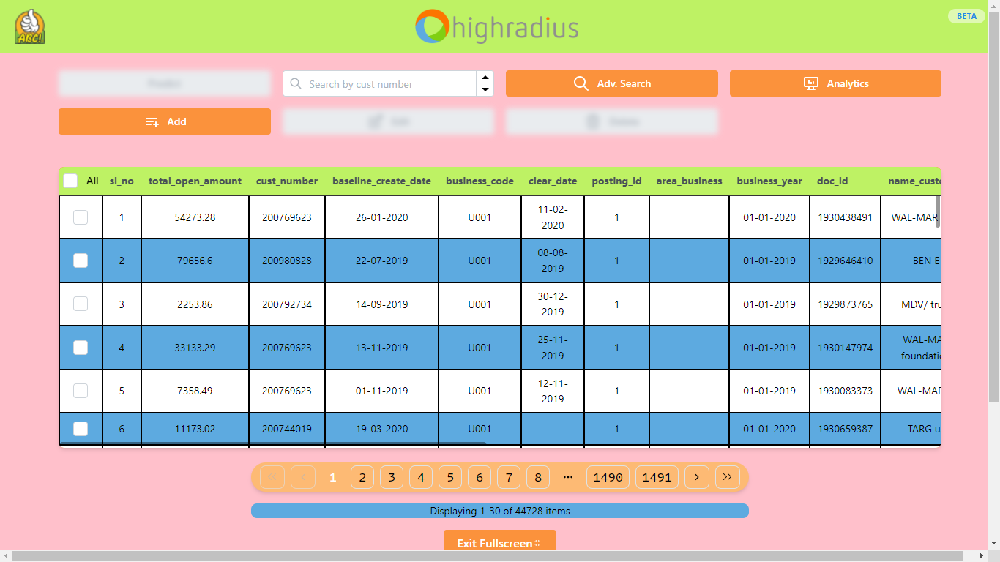
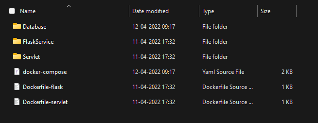
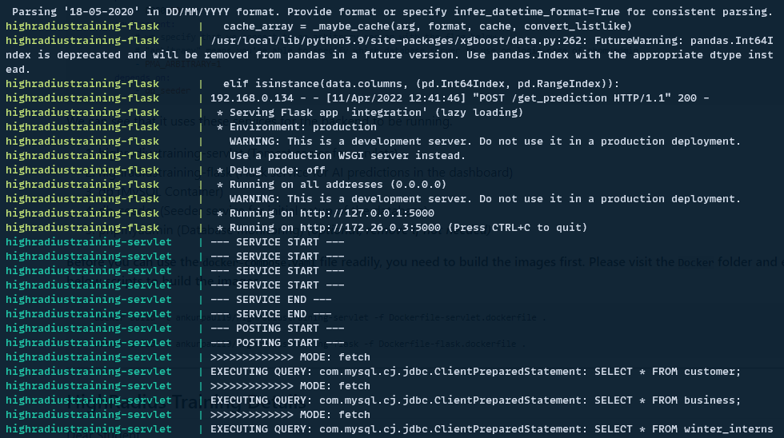

<h1 align="center">Highradius Dashboard 🖥️</h1>

*This project is built with React18 support which means it has bleeding edge support of the latest web framework. **To get started in clicks, follow the <a href="#docker-deployment">docker deployment guide</a> below.***



> [Screenshots](Screenshots)

---

<h2>Project Status</h2>

[](https://github.com/nooobcoder/HighRadiusTraining/actions/workflows/build_release.yaml)

---

<h2>Technology Stacks Used</h2>

### 1. Backend

- [MySQL](https://dev.mysql.com/doc/) (Database)
- [JDBC](https://mvnrepository.com/artifact/mysql/mysql-connector-java) w/ [Servlets](https://mvnrepository.com/artifact/javax.servlet/javax.servlet-api) (Java to Database Connectivity/API/ORM)
- [Maven](https://maven.apache.org/) (Dependency Management)
- [Tomcat 10](https://tomcat.apache.org/download-10.cgi) (Server for Servlets)
- [Python3](https://www.python.org/)
- [Flask](https://flask.palletsprojects.com/en/2.1.x/) (Server for Machine Learning Model)

### 2. Frontend

- [React 18 ⚛️](https://reactjs.org/) (Frontend)
- [NodeJS](https://nodejs.org/en/) (Server)
- [Axios](https://axios-http.com/docs/intro) (API Communicator)
- [Redux Toolkit](https://redux-toolkit.js.org/) w/ Redux thunk

### 3. CI/CD 🛠️ and Orchestration 📦

- [Docker](https://www.docker.com/) 🐳 (w/ Dockerfiles and docker-compose)

  - [Dockerfile](https://docs.docker.com/engine/reference/builder/)
  - [docker-compose](https://docs.docker.com/compose/)

- [Github Actions](https://github.com/features/actions)

---

<h2> Getting Started </h2>

<h3> Easy Deployment </h3>

<h4 id="docker-deployment"><a> Backend Deployment using Docker</a> </h4>

1. Please visit the <a href="Track%204_ReactJS_Web%20Development/Project/Docker/" target="_blank">Docker folder</a> to have a glance at the setup files

You would get a similar folder structure as shown in the image below.


Now take a look at the `docker-compose.yaml` file, that would expose us to the services that would be references while running the backend using Docker.

```yaml
version: "3"

services:
    highradiustraining-servlet:
        container_name: highradiustraining-servlet
        deploy:
            replicas: 1
            restart_policy:
                condition: unless-stopped
        ports:
            - "280:8080"
        image: ankurpaul19/highradiustraining-servlet
    highradiustraining-flask:
        container_name: highradiustraining-flask
        deploy:
            replicas: 1
            restart_policy:
                condition: unless-stopped
        ports:
            - "5000:5000"
        image: ankurpaul19/highradiustraining-flask

    db:
        image: mysql:5.7
        command: --default-authentication-plugin=mysql_native_password
        volumes:
            - /var/lib/mysql:/var/lib/mysql
        restart: always
        environment:
            - MYSQL_ROOT_PASSWORD=mysql
            - MYSQL_DATABASE=grey_goose
            - MYSQL_USER=mysql
            - MYSQL_PASSWORD=mysql
        ports:
            - "3306:3306"

    db_seeder:
        image: mysql:latest
        volumes:
            - ./Database/db.sql:/db.sql
        environment:
            - MYSQL_ALLOW_EMPTY_PASSWORD=true
        entrypoint:
            [
                "bash",
                "-c",
                "sleep 10 && mysql --user=mysql --password=mysql --host=db --port=3306 grey_goose < /db.sql && exit",
            ]
        depends_on:
            - db

    phpmyadmin:
        image: phpmyadmin:latest
        restart: unless-stopped
        ports:
            - 8080:80
        environment:
            # we specify that we connect to an arbitrary server with the flag below
            # "arbitrary" means you're able to specify which database server to use on login page of phpmyadmin
            - PMA_ARBITRARY=1
        depends_on:
            - db_seeder
```

We can see that it uses these services for the backend to be running.

1. highradiustraining-servlet (Tomcat server for servlets)
2. highradiustraining-flask (Flask service for AI predictions in the dashboard)
3. db (MySQL Container)
4. db_seeder (Seeder service for initial setup of the database)
5. phpmyadmin (Database monitoring) ***(optional, remove if not needed)***

**Before you can use the `docker-compose.yaml` file readily, you need to build the images first. Please visit the `Docker` folder and execute the below scripts to build the images.**

```sh
    docker build -t ankurpaul19/highradiustraining-servlet -f Dockerfile-servlet.dockerfile .
  
    docker build -t ankurpaul19/highradiustraining-flask -f Dockerfile-flask.dockerfile .
```

Once the images are built, you can **start the containers** from the docker-compose.yaml file by,

`docker-compose up` *(-d to detach from the console and keep running in the background)*


<h4 id="frontend-deployment"><a> Frontend Deployment </a></h4>

1. Navigate to the <a href="Track%204_ReactJS_Web%20Development/Project/Frontend/hrc-dashboard" target="_blank">Frontend folder</a>.

2. Install the dependencies for the web project using your preferred package manager (<a href="https://yarnpkg.com/" target="_blank">yarn</a> / <a href="https://www.npmjs.com/" target="_blank">npm</a>)

    > `yarn install` or `npm install`
    > 
    
3. Perform a build of the project. Please make modifications to the `.env` file by copying the default variables from [`.env.example`](Track%204_ReactJS_Web%20Development/Project/Frontend/hrc-dashboard/.env.example) file.

    **Build the Project or download the build from <a href="https://github.com/nooobcoder/HighRadiusTraining/releases" target="_blank">releases</a>.**
    
    > `yarn build` or `npm run build`
    
    > The build time shall be around ~3 minutes ⌚ depending upon your pc specs.

---

## HighRadius Training Details

<p>Dear Student,

Finally the wait is over! The day has come when we are about to start with the internship program. So, brace yourselves for the upcoming roller coaster ride. The starting date for the Internship is **27-Jan 2022**. The tenure for the Internship will be of 11 weeks wherein you'll be responsible to build an **AI Enabled Fintech B2B Invoice Management Application.**.

</p>

> Please read the [PRS Document](PRS.pdf) to get in-depth knowledge about the project.

Hope you have a pleasant journey ahead!

Regards,  
**HighRadius Corporation**

 
