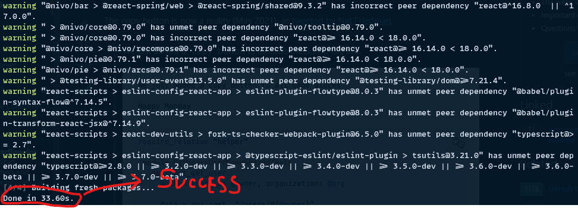

[](https://github.com/nooobcoder/HighRadiusTraining/actions/workflows/build_release.yaml)
[](http://ansicolortags.readthedocs.io/?badge=latest)
[](LICENSE)
[](https://github.com/nooobcoder/HighRadiusTraining)
[](https://github.com/nooobcoder/HighRadiusTraining/releases)
[](https://github.com/nooobcoder/HighRadiusTraining/commit)

---

<h1 align="center">Highradius Dashboard 🖥️</h1>

*This project is built with [**React18**](https://reactjs.org/blog/2021/06/08/the-plan-for-react-18.html) support which means it has bleeding edge support of the latest web framework. **To get started in clicks, follow the <a href="#docker-deployment">docker deployment guide</a> below or follow the <a href="#coders-deployment">coder's guide (advanced)</a>.***


> [Screenshots](Screenshots)

---

<h2 class="code-line" data-line-start=0 data-line-end=1 ><a id="Project_Milestone_0"></a>Project Milestone</h2>
<p class="has-line-data" data-line-start="2" data-line-end="4">The mandatory features are compulsory tasks and the optional features are for<br>
extra credit points, which will give you an added advantage.</p>
<table class="table table-striped table-bordered">
<thead>
<tr>
<th>Mandatory Features</th>
<th>Optional Features</th>
</tr>
</thead>
<tbody>
<tr>
<td><input type="checkbox" id="checkbox56" checked="true"><label for="checkbox56">1. UI Creation</label></td>
<td><input type="checkbox" id="checkbox57" checked="true"><label for="checkbox57">1. Predict Button activation with Grid Data</label></td>
</tr>
<tr>
<td><input type="checkbox" id="checkbox58" checked="true"><label for="checkbox58">2. Grid Creation</label></td>
<td><input type="checkbox" id="checkbox59" checked="true"><label for="checkbox59">2. Shortcut search button on Grid for Customer Id</label></td>
</tr>
<tr>
<td><input type="checkbox" id="checkbox60" checked="true"><label for="checkbox60">3. Grid Data Loading</label></td>
<td><input type="checkbox" id="checkbox61"><label for="checkbox61">3. Sorting columns</label></td>
</tr>
<tr>
<td><input type="checkbox" id="checkbox62" checked="true"><label for="checkbox62">4. Crud Operation (ADD/EDIT/DEL)</label></td>
<td><input type="checkbox" id="checkbox63" checked="true"><label for="checkbox63" >4. View - Analytics</label></td>
</tr>
<tr>
<td><input type="checkbox" id="checkbox64" checked="true"><label for="checkbox64">5. Pagination</label></td>
<td></td>
</tr>
<tr>
<td><input type="checkbox" id="checkbox65" checked="true"><label for="checkbox65">6. Advanced Search</label></td>
<td></td>
</tr>
</tbody>
</table>
<br/>


---

<h2>Technology Stacks Used</h2>

[](https://https://docker.com/)
[](https://https://maven.apache.org/)
[](https://www.python.org/)


---

### 1. Backend

- [MySQL](https://dev.mysql.com/doc/) (Database)
- [JDBC](https://mvnrepository.com/artifact/mysql/mysql-connector-java) w/ [Servlets](https://mvnrepository.com/artifact/javax.servlet/javax.servlet-api) (Java to Database Connectivity/API/ORM)
- [Maven](https://maven.apache.org/) (Dependency Management)
- [Tomcat 10](https://tomcat.apache.org/download-10.cgi) (Server for Servlets)
- [Python3](https://www.python.org/)
- [Flask](https://flask.palletsprojects.com/en/2.1.x/) (Server for Machine Learning Model)

### 2. Frontend

- [React 18 ⚛️](https://reactjs.org/) (Frontend)
- [NodeJS](https://nodejs.org/en/) (Server)
- [Axios](https://axios-http.com/docs/intro) (API Communicator)
- [Redux Toolkit](https://redux-toolkit.js.org/) w/ Redux thunk

### 3. CI/CD 🛠️ and Orchestration 📦

- [Docker](https://www.docker.com/) 🐳 (w/ Dockerfiles and docker-compose)

  - [Dockerfile](https://docs.docker.com/engine/reference/builder/)
  - [docker-compose](https://docs.docker.com/compose/)

- [Github Actions](https://github.com/features/actions)

### 4. Development Tools
- [IntelliJ IDEA Ultimate](https://www.jetbrains.com/idea/business/) (Ultimate is necessary for JavaEE projects and tomcat servers configuration.)

- [Raspberry Pi](https://www.raspberrypi.org/)

- [Gitpod OpenVSCode Server](https://github.com/gitpod-io/openvscode-server) ([For air gapped development environment](https://coder.com/docs/coder/latest/setup/air-gapped).)

- [Postman for API Testing](https://www.postman.com/)


---

<h2> Getting Started </h2>

<h3> Easy Deployment </h3>

<h4 id="docker-deployment"><a> Backend Deployment using Docker</a> </h4>

1. Please visit the <a href="Track%204_ReactJS_Web%20Development/Project/Docker/" target="_blank">Docker folder</a> to have a glance at the setup files

You would get a similar folder structure as shown in the image below.


Now take a look at the `docker-compose.yaml` file, that would expose us to the services that would be references while running the backend using Docker.

```yaml
version: "3"

services:
    highradiustraining-servlet:
        container_name: highradiustraining-servlet
        deploy:
            replicas: 1
            restart_policy:
                condition: unless-stopped
        ports:
            - "280:8080"
        image: ankurpaul19/highradiustraining-servlet
    highradiustraining-flask:
        container_name: highradiustraining-flask
        deploy:
            replicas: 1
            restart_policy:
                condition: unless-stopped
        ports:
            - "5000:5000"
        image: ankurpaul19/highradiustraining-flask

    db:
        image: mysql:5.7
        command: --default-authentication-plugin=mysql_native_password
        volumes:
            - /var/lib/mysql:/var/lib/mysql
        restart: always
        environment:
            - MYSQL_ROOT_PASSWORD=mysql
            - MYSQL_DATABASE=grey_goose
            - MYSQL_USER=mysql
            - MYSQL_PASSWORD=mysql
        ports:
            - "3306:3306"

    db_seeder:
        image: mysql:latest
        volumes:
            - ./Database/db.sql:/db.sql
        environment:
            - MYSQL_ALLOW_EMPTY_PASSWORD=true
        entrypoint:
            [
                "bash",
                "-c",
                "sleep 10 && mysql --user=mysql --password=mysql --host=db --port=3306 grey_goose < /db.sql && exit",
            ]
        depends_on:
            - db

    phpmyadmin:
        image: phpmyadmin:latest
        restart: unless-stopped
        ports:
            - 8080:80
        environment:
            # we specify that we connect to an arbitrary server with the flag below
            # "arbitrary" means you're able to specify which database server to use on login page of phpmyadmin
            - PMA_ARBITRARY=1
        depends_on:
            - db_seeder
```

We can see that it uses these services for the backend to be running.

1. highradiustraining-servlet (Tomcat server for servlets)
2. highradiustraining-flask (Flask service for AI predictions in the dashboard)
3. db (MySQL Container)
4. db_seeder (Seeder service for initial setup of the database)
5. phpmyadmin (Database monitoring) ***(optional, remove if not needed)***

**Before you can use the `docker-compose.yaml` file readily, you need to build the images first. Please visit the `Docker` folder and execute the below scripts to build the images.**

```sh
    docker build -t ankurpaul19/highradiustraining-servlet -f Dockerfile-servlet.dockerfile .
  
    docker build -t ankurpaul19/highradiustraining-flask -f Dockerfile-flask.dockerfile .
```

Once the images are built, you can **start the containers** from the docker-compose.yaml file by,

`docker-compose up` *(-d to detach from the console and keep running in the background)*


<h4 id="frontend-deployment"><a> Frontend Deployment </a></h4>

1. Navigate to the <a href="Track%204_ReactJS_Web%20Development/Project/Frontend/hrc-dashboard" target="_blank">Frontend folder</a>.

2. Install the dependencies for the web project using your preferred package manager (<a href="https://yarnpkg.com/" target="_blank">yarn</a> / <a href="https://www.npmjs.com/" target="_blank">npm</a>)

    > `yarn install` or `npm install`
    > 
    
3. Perform a build of the project. Please make modifications to the `.env` file by copying the default variables from [`.env.example`](Track%204_ReactJS_Web%20Development/Project/Frontend/hrc-dashboard/.env.example) file.

    **Build the Project or download the build from <a href="https://github.com/nooobcoder/HighRadiusTraining/releases" target="_blank">releases</a>.**
    
    > `yarn build` or `npm run build`
    
    > The build time shall be around ~3 minutes ⌚ depending upon your pc specs.

---

<h3>  ⚠️ ADVANCED Deployment </h3>
<h4 id="coders-deployment"> Coder's Guide  </h4>

<h5> 1. Backend Setup </h5>

- Open the <a href="Track%204_ReactJS_Web%20Development/Project/Backend/API/demo/" target="_blank">backend project</a> in your favorite IDE like <a href="https://www.jetbrains.com/idea/business/" target="_blank">IntelliJ IDEA</a> or <a href="https://www.eclipse.org/" target="_blank">Eclipse</a>.

    You would get a similar folder structure for the <a href="Track%204_ReactJS_Web%20Development/Project/Backend/API/demo/" target="_blank">**backend project**</a>.
    

- Bootstrap/Prepare Tomcat as per your IDE.

- In IntelliJ IDEA you can see the build configuration here and perform the build server setup following the images below.
  
  1. 
  2. 
  3. 
  4. 
  5. 
  6. 
  7. 


<h5> 2. Frontend Setup </h5>

  1. Folder Structure
  
     
  
  2. Install the dependencies
     
     
     
  3. Copy the <a href="Track%204_ReactJS_Web%20Development/Project/Frontend/hrc-dashboard/.env.example" target="_blank">`.env.example`</a> -> `.env.local` and tweak the **env variables** as per your setup.
  
     
     
  4. Run <a  href="Track%204_ReactJS_Web%20Development/Project/Frontend/hrc-dashboard/package.json" target="_blank">`yarn serve`</a> in the terminal (**script source from package.json**).
     
     

<h5> 3. Postman Setup </h5>

Please [import](https://learning.postman.com/docs/getting-started/importing-and-exporting-data/) the followings for Postman to auto import the api endpoints

1. <a href="Track%204_ReactJS_Web%20Development/Project/Postman%20Collection/HighradiusWinterInternship.postman_collection.json" target="_blank">API Endpoint Folder</a>
2. <a href="Track%204_ReactJS_Web%20Development/Project/Postman%20Collection/HighRadius%20Training.postman_environment.json" target="_blank">Environment Variables</a>

**API Route Table**

<table class="table table-striped table-bordered">
<thead>
<tr>
<th>Service</th>
<th>Request Name</th>
<th>Request Type</th>
<th>Request Endpoint</th>
<th>URL Parameters</th>
<th>JSON Body</th>
<th>Description</th>
<th>CURL Equivalent</th>
</tr>
</thead>
<tbody>
<tr>
<td>Servlets</td>
<td>GET ROWS</td>
<td>POST</td>
<td><a href="http://192.168.0.118:280/getrows">http://192.168.0.118:280/getrows</a></td>
<td>?start=0&amp;limit=10</td>
<td></td>
<td>Gets the rows from start to the next limit rows</td>
<td>curl --location --request POST ’<a href="http://192.168.0.118:280//getrows?start=0&amp;limit=10">http://192.168.0.118:280//getrows?start=0&amp;limit=10</a>’ \ --header ‘Content-Type: application/json’</td>
</tr>
<tr>
<td>Servlets</td>
<td>GET ANALYTICS</td>
<td>POST</td>
<td><a href="http://192.168.0.118:280/getanalytics">http://192.168.0.118:280/getanalytics</a></td>
<td></td>
<td>{     “clear_date”: [         “2019-01-01”,         “2020-12-31”     ],     “due_in_date”: [         “2019-01-01”,         “2020-12-31”     ],     “baseline_create_date”: [         “2019-01-01”,         “2020-12-31”     ],     “invoice_currency”: “INR” }</td>
<td>Returns an array with analytics data. Refer JSON body</td>
<td>curl --location --request POST ’<a href="http://192.168.0.118:280//getanalytics">http://192.168.0.118:280//getanalytics</a>’ \ --header ‘Content-Type: application/json’ \ --data-raw ‘{     “clear_date”: [         “2019-01-01”,         “2020-12-31”     ],     “due_in_date”: [         “2019-01-01”,         “2020-12-31”     ],     “baseline_create_date”: [         “2019-01-01”,         “2020-12-31”     ],     “invoice_currency”: “INR” }’</td>
</tr>
<tr>
<td>Servlets</td>
<td>ADD ROWS</td>
<td>POST</td>
<td><a href="http://192.168.0.118:280/addRow">http://192.168.0.118:280/addRow</a></td>
<td></td>
<td>{     “sl_no”:48558,     “business_code”: null,     “cust_number”: “200020431”,     “name_customer”:“test company”,     “clear_date”: “2022-3-1”,     “business_year”: null,     “doc_id”: null,     “posting_date”: “2022-3-1”,     “document_create_date”: “2022-3-2”,     “document_create_date1”: null,     “due_in_date”: “2022-3-19”,     “invoice_currency”: “”,     “document_type”: null,     “posting_id”: null,     “area_business”: null,     “total_open_amount”: null,     “baseline_create_date”: “2022-3-15”,     “cust_payment_terms”: null,     “invoice_id”: null,     “isOpen”: null,     “aging_bucket”: null }</td>
<td>Adds the rows that is passed as JSON raw body</td>
<td>curl --location --request POST ’<a href="http://192.168.0.118:280//addRow">http://192.168.0.118:280//addRow</a>’ \ --header ‘Content-Type: application/json’ \ --data-raw ‘{     “sl_no”:48558,     “business_code”: null,     “cust_number”: “200020431”,     “name_customer”:“test company”,     “clear_date”: “2022-3-1”,     “business_year”: null,     “doc_id”: null,     “posting_date”: “2022-3-1”,     “document_create_date”: “2022-3-2”,     “document_create_date1”: null,     “due_in_date”: “2022-3-19”,     “invoice_currency”: “”,     “document_type”: null,     “posting_id”: null,     “area_business”: null,     “total_open_amount”: null,     “baseline_create_date”: “2022-3-15”,     “cust_payment_terms”: null,     “invoice_id”: null,     “isOpen”: null,     “aging_bucket”: null }’</td>
</tr>
<tr>
<td>Servlets</td>
<td>ADVANCED SEARCH</td>
<td>POST</td>
<td><a href="http://192.168.0.118:280/advancedSearch">http://192.168.0.118:280/advancedSearch</a></td>
<td></td>
<td>{     “doc_id”: 1929873765,     “invoice_id”: 1929873765,     “cust_number”: 200792734,     “business_year”: 2019 }</td>
<td>Performs advanced search with the fields passed. Refer PRS and JSON body for example.</td>
<td>curl --location --request POST ’<a href="http://192.168.0.118:280//advancedSearch">http://192.168.0.118:280//advancedSearch</a>’ \ --header ‘Content-Type: application/json’ \ --data-raw ‘{     “doc_id”: 1929873765,     “invoice_id”: 1929873765,     “cust_number”: 200792734,     “business_year”: 2019 }’</td>
</tr>
<tr>
<td>Servlets</td>
<td>GET BUSINESSES</td>
<td>GET</td>
<td><a href="http://192.168.0.118:280/getbusinesses">http://192.168.0.118:280/getbusinesses</a></td>
<td></td>
<td></td>
<td>Returns the businesses with their codes in the database.</td>
<td>curl --location --request GET ’<a href="http://192.168.0.118:280//getbusinesses">http://192.168.0.118:280//getbusinesses</a>’</td>
</tr>
<tr>
<td>Servlets</td>
<td>GET CUSTOMERS</td>
<td>GET</td>
<td><a href="http://192.168.0.118:280/getcustomers">http://192.168.0.118:280/getcustomers</a></td>
<td></td>
<td></td>
<td>Returns the customers with their codes in the database.</td>
<td>curl --location --request GET ’<a href="http://192.168.0.118:280/getcustomers">http://192.168.0.118:280/getcustomers</a>’</td>
</tr>
<tr>
<td>Servlets</td>
<td>EDIT ROW</td>
<td>POST</td>
<td><a href="http://192.168.0.118:280/editRow">http://192.168.0.118:280/editRow</a></td>
<td>?serialNumber=2&amp;tableName=winter_internship</td>
<td>{     “invoice_currency”: “USD”,     “cust_payment_terms”: “NAA8” }</td>
<td>Edits a row by sending a RAW JSON body</td>
<td>curl --location --request POST ’<a href="http://192.168.0.118:280//editRow?serialNumber=2&amp;tableName=winter_internship">http://192.168.0.118:280//editRow?serialNumber=2&amp;tableName=winter_internship</a>’ \ --header ‘Content-Type: application/json’ \ --data-raw ‘{     “invoice_currency”: “USD”,     “cust_payment_terms”: “NAA8” }’</td>
</tr>
<tr>
<td>Servlets</td>
<td>DELETE ETEROW</td>
<td>DELETE</td>
<td><a href="http://192.168.0.118:280/deleteRow">http://192.168.0.118:280/deleteRow</a></td>
<td>?sl_no=48568,48569,48570</td>
<td></td>
<td>Deletes a row or a range of rows</td>
<td>curl --location --request DELETE ’<a href="http://192.168.0.118:280//deleteRow?sl_no=48568,'">http://192.168.0.118:280//deleteRow?sl_no=48568,’</a> \ --header ‘Content-Type: application/json’ \ --data-raw ‘’</td>
</tr>
<tr>
<td>Flask</td>
<td>GET PREDICTION</td>
<td>POST</td>
<td><a href="http://192.168.0.118:5000/get_prediction">http://192.168.0.118:5000/get_prediction</a></td>
<td></td>
<td>{     “data”: [     1929646410,     1929873765,     1930147974,     1930083373,     1930659387,     1929439637,     1928819386,     1930610806,     1928550622,     1929151655,     1930022117,     1930788296,     1930817482,     1930052739,     1930209407,     1930153511,     1930438462,     1991837617,     1929773400,     1930676042,     1929626925,     1930431304,     1928620435,     1930592246,     1929194820,     1929170780,     1929907681,     1929847863,     1929541405,     null     ] }</td>
<td>Does prediction on the array of doc ids passed to it.</td>
<td>curl --location --request POST ’<a href="http://192.168.0.118:5000/get_prediction">http://192.168.0.118:5000/get_prediction</a>’ \ --header ‘Content-Type: application/json’ \ --data-raw ‘{     “data”: [     1929646410,     1929873765,     1930147974,     1930083373,     1930659387,     1929439637,     1928819386,     1930610806,     1928550622,     1929151655,     1930022117,     1930788296,     1930817482,     1930052739,     1930209407,     1930153511,     1930438462,     1991837617,     1929773400,     1930676042,     1929626925,     1930431304,     1928620435,     1930592246,     1929194820,     1929170780,     1929907681,     1929847863,     1929541405,     null     ] }’</td>
</tr>
<tr>
<td>Flask</td>
<td>PREDICT 200 ROWS</td>
<td>POST</td>
<td><a href="http://192.168.0.118:5000/all">http://192.168.0.118:5000/all</a></td>
<td></td>
<td></td>
<td>Gets prediction of first 200 rows from Final.csv. This is for debugging purpose only that the flask service works.</td>
<td>curl --location --request POST ’<a href="http://192.168.0.118:5000/all">http://192.168.0.118:5000/all</a>’</td>
</tr>
<tr>
<td></td>
<td></td>
<td></td>
<td></td>
<td></td>
<td></td>
<td></td>
<td></td>
</tr>
<tr>
<td></td>
<td></td>
<td></td>
<td></td>
<td></td>
<td></td>
<td></td>
<td></td>
</tr>
</tbody>
</table>

---

## HighRadius Training Details

<p>Dear Student,

Finally the wait is over! The day has come when we are about to start with the internship program. So, brace yourselves for the upcoming roller coaster ride. The starting date for the Internship is **27-Jan 2022**. The tenure for the Internship will be of 11 weeks wherein you'll be responsible to build an **AI Enabled Fintech B2B Invoice Management Application.**.

</p>

> Please read the [PRS Document](PRS.pdf) to get in-depth knowledge about the project.

Hope you have a pleasant journey ahead!

Regards,  
**HighRadius Corporation**

 
---

[](https://jupyter.org/try)
[](https://www.javascript.com)
[](https://creativecommons.org/licenses/by-nc-sa/4.0)
